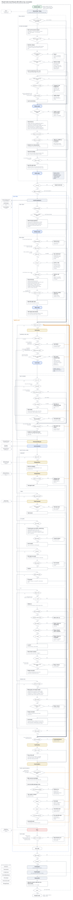

# aphrollo-tools roadmap

Last updated 2026-10-02. The working copy is the shared roadmap doc; this file follows it.

aphrollo-tools stops reacting issue by issue and grows in six phases toward four results: a stable core with a compatibility promise, one event log joined with Claude Code's telemetry, an integration layer that works without GitHub, and a lead's dashboard on top.

## Where it stands

The tool works, but every engine change still reaches consuming repos as a surprise. The fixes landed fast; the design did not keep pace.

| Measure, 2026-09-29 to 09-30 | Count |
| --- | --- |
| PRs merged | 41 |
| Issues opened | 88 |
| Issues closed | 93 |
| Escapes recorded (a red after a local green) | 26 |
| Issues reported by consuming repos (`gate feedback`) | 20 |
| Issues open now | 16 |

What the two days showed:

- **Consumers absorb the breakage.** A lexer fix gave fanvue 947 false hits on an unchanged tree (#1023); a Windows test run became a 1,900-process fork bomb (#997); fanvue can't merge at all during a GitHub billing lock (#1064).
- **Safety came late.** Tests wrote into the real repository and the global git config (#1043) before isolation and canaries existed.
- **Cost was invisible until measured.** A mutant reached 26 GB (#1005), and a commit-time run took 5 minutes before anyone timed it (#1067).
- **Retros work, but by hand.** Most lessons became rules only after the same failure repeated two or three times.

## Architecture

trellis sits between Claude Code and an integration backend. Claude Code supplies hooks, native worktrees, telemetry, transcripts and Artifact pages. The integration backend, which merges lanes and runs CI, is GitHub or a local one on plain git, and both run the same trellis binary in CI. Inside trellis, the gate is the pipeline: at edit, commit and merge it calls the runners, ratchet and mutation.

Worktrees turns Claude's worktrees into lanes whose state the gate sets: a real red opens a lane's code edits, a green or an escape closes them, and a merge-gate pass hands the lane to the integration layer, which merges it on GitHub or, with the local backend, through trellis's own merge queue and local CI. Setup installs, updates and rolls back. Every part runs on the shared foundation and keeps its config and state in one versioned place, which the automatic migrations act on. Events from every part, git, CI, Claude Code's telemetry and session transcripts land in the event store. The lead view reads it as an Artifact page. The learning loop closes inside trellis: an escape becomes a new law or gate stage, built test-first in a lane of its own.

## Compatibility policy

A `trellis update` never turns a green consuming repo red on its own. Every change that could is versioned, migrated automatically and announced.

1. **Versions.** Each release carries a semantic version next to the build stamp. A change to any verdict a consumer sees (laws, masks, gates, mutation) is at least a minor bump. Every persisted format carries its own format number (the scan-view stamp from #1050 is the pattern), and append-only logs carry one per record; readers skip record versions they do not know. A repo declares the oldest trellis it accepts in `trellis.toml` (`requires = ">=1.4"`, like go.mod's `go` line): an older binary refuses with the version it needs (trellis too old here) and names trellis update, which fetches it; it never misreads newer state.
2. **Consumer changelog.** One file lists, per release, what a consumer will notice and what migrates by itself, in plain words. Commit history stays the developer's record.
3. **Automatic migration.** Derived data (caches, the scan cache, the managed CLAUDE.md block, hook shims) is never migrated: whichever binary runs recomputes it. Committed data (baselines, `trellis.toml`) migrates itself on first run, is checked by recomputation, and lands as its own commit, so `git revert` undoes it. Local state (the event store, the ledger) is copied to `.bak.<version>` before a migration. A format change ships in two releases: the first reads the new format and still writes the old one, the next writes the new one. There is never a required manual step.
4. **Replay before release, and before every update.** CI replays each release against this repo, pinned public repos for every supported language and a synthetic tree generated to fanvue's size and file mix, on Linux and on Windows; it ships only with zero new hits on unchanged trees, which is the #1023 test made general. The replay also runs the previous release's binary on the tree the new one migrated, and it must read it cleanly. On each box, `update` first runs the new binary read-only beside the current one, in the background, and uses it from the next start; if its verdicts differ on an unchanged tree, the update stays staged and names the difference (`trellis 1.5 would add 947 hits in comment-after-string; kept 1.4`). No client code or telemetry leaves the box it runs on.
5. **Safety invariants, enforced in code.** A test process never touches a real repo or the global config (#1043, fixed by PR #1044). No child runs without a memory cap (#1005). No hook writes a shim pointing at a temporary binary (#1033). Every runner carries a canary that refuses its own result on a violation.
6. **Rollback.** `trellis update --to <version>` reinstalls any earlier release and records it as a pin override in the user layer, which SessionStart honours until a plain trellis update clears it; the last 3 binaries stay on the box. Rolling back one release is always safe, because every format change ships read-before-write (item 3). Further back, the repo's declared minimum version makes the older binary refuse with the version it needs; it never misreads newer state.

## Roadmap

Six phases in order; each starts only when the previous gate is met. The name decision sits between core and plugin, because only the plugin carries the name.

1. **0 · Now**: unblock fanvue, the paused lane, a minimal event log. Gate: fanvue merges; events are logged.
2. **1a · Core**: compatibility, Windows CI, red to green, guardrails, escapes, #1078, #1079. Gate: a release replays with 0 new hits.
3. **Decision**: move to trellis, a new repo under harryberg1n.
4. **1b · Setup and worktrees**: launcher, config, session and repo start, lanes on a write to main. Gate: setup on a new box is one step.
5. **2 · Events**: the full event log joined with OpenTelemetry. Gate: retro numbers come from events.
6. **3 · Integration**: CI under the merge verb, local merges; Artifact review. Gate: a merge completes without GitHub.
7. **4 · Lead view**: a dashboard as an Artifact page, metrics only. Gate: one page shows what worked.

No dates yet: each phase is sized when it starts, from what the event log then measures.

### The plan: from aphrollo to the session flow

The target is the session flow in the repo's `docs/trellis-flow` (on `main` since #1082): every trellis step drawn at the Claude Code hook that runs it. Most of it exists in aphrollo today. The table says what each phase builds to get there and what it starts from; the phase gates stay as they are, and nothing new enters a phase that is already running.

| # | Workstream | What gets built | Starts from today | Phase |
| --- | --- | --- | --- | --- |
| 1 | Red to green, finished | R13's test-edit rule; tdd = off, warn (the next step as guidance) or enforce; a four-way run result where "not tested" keeps the last real verdict | the edit ledger, fail-first, deny laws at edit time | 1a |
| 2 | Guardrails and guidance | R1's guardrails: secrets, attribution, destructive or outward-facing calls, enforce-mode red to green, deny laws; long waits and noisy output become guidance instead of blocks | guardrail pretooluse, the edit smells | 1a |
| 3 | Escapes and feedback | one definition: a red after a local green; a CI red closes code edits until a test reproduces it; `trellis feedback` records a wrong deny | gate escape record, auto-escape, gate feedback | 1a |
| 4 | Stop, task and subagent checks | Stop blocks once on an unseen red; SubagentStop runs the same check; TaskCompleted exits 2 while the task's tests are red | deferred runs, gate status | 1a |
| 5 | Edit results | PostToolUse formats the file and names it; the tests run once per batch at PostToolBatch; unproven packages are marked | the post-edit hooks, BUILDING deferred | 1a |
| 6 | Launcher and binary | the plugin pin and a pin override in the user layer; fetch, verify and keep the last 3; a newer pin staged until a background comparison is on record; `trellis update` repairs a missing binary; `requires` refuses instead of fetching | aphrollo update, the release workflow | 1b |
| 7 | Configuration | four layers with a checked schema; the setup record and a repo's decline in the user layer; TRELLIS\_CONFIG; `trellis config show` and `set`, with `--local` and `--session`; /gate retired | aphrollo.toml, gate allow and revoke | 1b |
| 8 | Session start | Check the box, which names a git identity the commit gate would refuse; the gate rules injected on every start; clear and compact skip the checks; every hook silent where trellis is off (R5) | gate sessionstart, doctor | 1b |
| 9 | First start and Repo start | the setup questions; an old aphrollo install removed on a yes, with a backup; repo decided or declined, git init, `requires`, set up the repo (merge.ff=false, branch protection offered with ci = github), a foreign git hook named, the rules injected, what finished told | aphrollo install, gate init, the features table | 1b |
| 10 | Lanes | a write on main gets a worktree (deny, then EnterWorktree); post-merge removes merged lanes no session is in; no WorktreeCreate hook; the managed CLAUDE.md block dropped once a test shows Claude follows the deny | the primary-checkout wall, workspace prune | 1b |
| 11 | CI under the merge verb | ci = local, github or auto; hosted-run states (pending up to 90 min, no ready PR, ci unavailable); the verdict recorded per lane head; pre-merge-commit refuses a head without one; a GitHub-side merge recorded like an escape; the open-a-PR verb | #1064 step 1, workspace merge and pr, ci why | 0 starts, 3 finishes |
| 12 | Events and retro | the retro reads the events at post-merge; wrong denies and enforce against warn measured | gate.log, gate stats | 2 |
| 13 | The flow stays the spec | each step is built with its test; a change of behaviour edits `docs/trellis-flow/session_flow.py` in the same PR, and the workbench's layout check stays clean | docs/trellis-flow | every phase |

Phase 1a now carries five workstreams. If it swells (Risks), workstreams 4 and 5 move to the start of 1b: they need no new packaging.

## Targets, risks and non-goals

The gates say when a phase is done; these targets say whether the work between them is getting better. They are measured from the minimal event log from phase 0 on.

| Target | Now (2026-09-29 to 09-30) | Goal |
| --- | --- | --- |
| Escapes recorded per week | 26 in two days | falling every week, under 3 by the end of phase 1a |
| Pushes after a PR opens | 1 to 4 per PR | under 1 on average |
| CI mutation check green on the first run | a minority of PRs | over 80% of PRs |
| Issues reported by consuming repos | 20 in two days | none caused by a release (the replay catches it first) |
| Wrong denies (a code edit denied that the gate should have allowed) | not measured | near 0; each one is recorded like an escape |
| tdd = enforce against warn, same tasks | not measured | enforce has fewer escapes without more tokens or time per task; otherwise warn becomes the default |

Risks:

- **Plugin migration doubles hooks.** A box with an old `aphrollo install` and the new plugin runs every hook twice. Only two boxes carry the old install (this one and the Windows box), so Check the box finds the old install, the global core.hooksPath included, and First start removes it on a yes, with a backup.
- **Phase 1 swells again.** Anything new goes into a later phase or the queue, not into a running one.
- **Claude Code overlaps us, or breaks us.** When the Claude Code version on a box changes, SessionStart matches the new changelog entries against a list of our features (hooks, worktrees, LSP, commit skills, telemetry, review) and names each hit in one line. Every hit gets a side-by-side comparison, not a reflex: correctness, speed, token cost, worktree awareness, safety and upkeep. The result is one of three: adopt theirs and delete ours (native worktrees replace `workspace create`), keep ours where it is better (rename, which starts a language server only for the rename, where the official LSP plugins keep one running and indexed `.worktrees` in the background), or combine them (their `verify` skill calling our gate). A hit that changes a hook payload is handled first, since it can break us.
- **The gate taxes the agentic loop.** Every deny costs Claude a round trip and every test run costs time. The tests run once per batch, each deny names the next step, and the enforce-against-warn comparison decides whether enforce stays the default.

Non-goals: no hosted service, no IDE extension, no reimplementing a Claude Code feature that exists natively, no tracking beyond the user's own box: no telemetry leaves the box it runs on (opt-in summaries, never code, may come later).

This doc is reviewed at every phase gate and after any week with more than 5 escapes.

## Requirements

The tool extends Claude Code instead of fighting it: every requirement below builds on a native feature (hooks, worktrees, skills, plugins, OpenTelemetry) and adds only what Claude Code lacks.

| # | Requirement | Spec | Phase |
| --- | --- | --- | --- |
| R1 | Give Claude wings, don't fight it | Refuse only real guardrails (secrets, attribution, destructive or outward-facing actions). Everything else is guidance in context. Never rewrite a tool's input behind Claude's back, so Claude's model of what it did stays true. | all |
| R2 | Fully automated setup | Distributed as a Claude Code plugin: enabling it installs the hooks, skills and agents. The plugin pins one binary version; SessionStart, Setup or trellis update fetches it from a GitHub Release when it is missing, verifies its sha256 and keeps the last 3 for rollback. No manual `install` or `gate init` step remains. | 1b |
| R3 | First run is a conversation | With no setup record, setup is pending, and at the first prompt UserPromptSubmit hands Claude the setup skill. Claude asks the four questions nothing can detect, once, in the main session: trellis everywhere or per repo, git init or ask, CI auto, local or GitHub, plugin auto-update. Everything about the code is detected per repo at Repo start, never asked and never stored. Later sessions and subagents start silently, and any setting changes later through trellis config, in conversation or typed (Configuration). | 1b |
| R4 | Repos and worktrees happen by themselves | Lanes are git worktrees under .claude/worktrees/, and a lane is its branch, whose gate state is made the first time a hook needs it; trellis hooks neither WorktreeCreate nor WorktreeRemove. By default (isolation = true) a write on main (code, a test, a doc or config; a gitignored file passes) makes one without asking: trellis adds the worktree from main, the deny names its path, and Claude passes that path to EnterWorktree and repeats the edit. A subagent with isolation: "worktree" gets its worktree from Claude Code, and SubagentStart briefs it. isolation = false keeps the work on main. A folder with no git gets git init or a question, as the user's Setup preference says. | 1b |
| R5 | Zero cost where not opted in | Plugin hooks fire in every repo. In a repo with no recorded yes, unless trellis runs everywhere, every hook answers in under 50 ms and fails open. SessionStart is the one exception: it still gets the binary and checks the box within its 200 ms, since a later CwdChanged or DirectoryAdded may enter an opted-in repo, but it injects nothing. | 1b |
| R6 | Analytics of the work | Collect everything, always: gate events, Claude Code's OpenTelemetry export with tool content, tokens and cost, transcripts, git and CI events, resource use. Local only, secrets redacted at write time, one store per owner (the repo's remote owner, else its parent folder), raw data kept 90 days, aggregated metrics forever. | 0 minimal, 2 full |
| R7 | Architecture for growth | Domains with one owner each, a written compatibility policy, and a roadmap that is kept current. | 1 |
| R8 | Not tied to GitHub, built on Claude's tools | Lanes run on Claude's native worktrees. Review, diffs, trackers and the lead view are Artifact pages with aggregated data only. Our own code covers what nothing else does: a merge queue and local CI on plain git, which also serves repos off GitHub and repos whose hosted CI is down (#1064). | 3 |
| R9 | A lead's overview | Per project, lane and week: loops, pushes, refusals, escapes, time open to merge, tokens and cost. What worked and what didn't, on one page. | 4 |
| R10 | Name and ownership settled once | A neutral name (no vendor mark), the repo owner chosen by ownership intent, and both changed in one migration. | before 1 |
| R11 | Windows is a first-class platform | A smoke job on GitHub-hosted windows-latest runs on every PR (#866, PR #987), and the pre-release replay runs on Windows too. Half the serious bugs of the last two days were Windows-only. | 1a |
| R12 | Minimal resources, only when needed | Nothing runs persistently that is not in use: no background language servers (all LSP plugins are off; a gopls had held 548 MB for 26 h), heavy work starts on demand, and the resource governor holds it back when the box lacks headroom. | all |
| R13 | Red to green is mechanical | Code edits open only on a new test's real red (missing implementation or failed assertion) and close on its green; editing the test before green needs a new red. Refactors of covered code pass while their tests stay green and every mutant on the changed lines dies, decided by the test map; new behaviour hidden in tested code leaves a survivor and is refused at commit. A Bash command is checked like an edit: PreToolUse parses its write targets, so a Bash write to code meets the same lane and red-to-green checks. Only a write no parser can see (a script that writes files, a generated file, an edit outside Claude) is found in the tree after the batch and marks its package unproven: Claude gets one line asking for the failing test, and the commit falls back to the re-run at HEAD. The commit gate reads the ledger's red-green pair and re-runs at HEAD only without one. A later red re-closes the lane until a test reproduces it. Red-to-green numbers go to the event store. | 1a, 2, 3 |

## Setup

Enabling the plugin is the whole install: the main session's first start becomes a short setup conversation, and every later session, subagent and repo uses what it recorded.

Setup uses only hooks Claude Code documents today. SessionStart, matched on its `source`, runs the checks on `startup`, `resume` and `fork`, and when /reload-plugins loads trellis mid-session; it skips them on `compact` and `clear`. Its `additionalContext` hands Claude the gate rules on every start, and `CLAUDE_ENV_FILE` puts the queue shims on PATH for every later command; each shim calls the plugin's launcher, never a binary path, so it stays current whichever binary runs. The `Setup` event (`claude --init-only`, `-p --init`, `--maintenance`) runs the same steps with written defaults for CI and cloud boxes, where nobody answers. `CwdChanged` and `DirectoryAdded` send a newly entered repo to Repo start. `SessionEnd` shares a 1.5 s budget, so it does nothing that can block. In an interactive session SessionStart runs in the background: you can type at once, but Claude's first response waits for it, so with nothing to do its checks finish in under 200 ms and only a fetch touches the network. A /clear while it still runs discards what it returns. Deliberately not used: PreToolUse `updatedInput` to redirect edits silently (R1).

**Distribution and updates.** There is no deploy runner and no build on the box. A merge to `main` that bumps the version runs a release workflow on GitHub-hosted runners (free on a public repo): it cross-compiles linux, darwin and windows for amd64 and arm64 and publishes a GitHub Release with sha256 sums. The plugin carries the hooks, skills and agents plus the one binary version it pins, so plugin and binary move together. Every hook calls a small launcher script in the plugin (sh, and PowerShell on Windows) that hands over to the pinned binary; only at SessionStart, Setup and trellis update does it fetch and verify one that is missing. Claude Code auto-updates plugins only from official marketplaces by default, so Setup asks once whether to turn it on for ours; a session nobody answers takes the written default. Claude Code has no plugin rollback, so trellis keeps the last 3 binaries in `CLAUDE_PLUGIN_DATA` and `trellis update --to <version>` switches back (Compatibility policy, item 6).

### Getting the binary

The launcher script in the plugin runs before every hook and always ends on a usable binary, or says plainly that there is none.

A download whose sha256 does not match is deleted and reported as a security error; it is never used. Without the pinned binary, the launcher runs the newest of the last 3 kept and warns once. Only with no binary on the box at all is trellis not ready for the session, which is not the same as "trellis off here", where a repo declined trellis. `systemMessage` tells you and `additionalContext` tells Claude (`trellis not ready: commits read as ungated; the merge gate checks them`). Nothing blocks the work: no commit gets the git note that marks it gated, so each reads as ungated, the same unproven path R13 uses for a Bash write. Nothing retries in the background: the notice names what failed and the fix, Claude fixes it first, and trellis update then runs Getting the binary again; once it succeeds, trellis is back mid-session. A fetch that runs past its time limit counts as a failed download, and a kept binary is written to a temp file and renamed into place under a lock, so two sessions starting together never share a half-written file. A clear or compact while trellis is not ready takes the full path again, so it never re-injects rules that are not running. CI and the merge gate check them anyway before anything reaches `main`.

## Configuration

Settings live in four layers, the later one winning, the same structure as Claude Code's own settings and git's config. Setup runs once in the main session; every later session, subagent and repo reads the result.

| Layer | Where | Set by | Example |
| --- | --- | --- | --- |
| Built-in defaults | in the binary | each release | `ci = "auto"` |
| User | `CLAUDE_PLUGIN_DATA/config.toml` | the first-run conversation, `trellis config set` | trellis everywhere, plugin auto-update on, a rollback's pin override |
| Repo | `trellis.toml`, committed | `trellis config set --repo`, through the commit gate | `undercover`, mutation policy, laws |
| Local | `trellis.local.toml`, gitignored | `trellis config set --local` | this machine merges fanvue through local CI |

A flag on one command (`--ci local`) beats every layer for that command only.

- **One way in, for people and for Claude.** `trellis config show` prints each effective value and the layer it came from, like `git config --show-origin`; `trellis config set <key> <value> [--user|--repo|--local|--session]` changes one. A skill wraps both, so "use local CI for fanvue" in conversation becomes that call. Nobody edits the files by hand. --session changes a key for this session only, which replaces the /gate command.
- **A schema, checked.** Every key has a type, its allowed values and the layers it may live in (`undercover` is repo-only: it is a policy for everyone working in the repo). An unknown key or a wrong value is refused with a suggestion, the same rule as an unknown flag.
- **Changes apply at once.** Every hook is a fresh process that reads the layers, so a user or local change applies on the next hook, with no restart; a repo change is code and applies once committed.
- **Detected values are never stored.** Languages, test runners and the remote are recomputed each time, the derived-data rule of the compatibility policy, so the config holds only overrides and never goes stale.
- **Every change is an event.** Who changed which key, in which layer, from what to what, lands in the event store, so the lead view can answer why fanvue merged without GitHub CI.
- **The first run asks four questions**, only what cannot be detected or safely defaulted: trellis everywhere or ask per repo; a folder without git gets `git init` or a question; CI auto, local or GitHub; plugin auto-update on or off. Their built-in answers are ask per repo, ask before git init and ci = "auto"; plugin auto-update keeps Claude Code's own default. Everything else starts from the defaults. A session nobody answers (`-p`, a routine, CI) takes the defaults, or a file handed in through `TRELLIS_CONFIG`.
- **CI is one setting:** `ci = "auto" | "local" | "github"`. `auto` uses GitHub when the remote is on GitHub and its jobs start, and falls back to local CI when they never start (the billing-lock case #1064 detects). Every merge prints which CI judged it and why. Merges are local (merge.ff=false): CI runs under the merge verb, before the merge, and the merge gate, which refuses a head without a CI verdict, runs in the repo's own pre-merge-commit hook (a conflicted merge reaches it through pre-commit when it is committed), and post-merge records every merge, one made by hand in a terminal included, so the next hook in the session tells Claude that the lane is closed.
- **Enforcement and isolation are settings, on by default.** `tdd = "enforce" | "warn" | "off"`: enforce denies a code edit before a real red (PreToolUse) and blocks the end of a turn once when a deferred run finished red after Claude's last hook, so Claude never stops on a red it has not seen (Stop and SubagentStop; never twice in a row, as stop\_hook\_active says; a red Claude has seen may end a turn), and keeps a task open while its tests are red (TaskCompleted, exit 2); warn gives the same next step as guidance instead of a deny, and off skips red to green but keeps guardrails and laws. The tests run once per batch of tool calls (PostToolBatch), not after every edit, and every deny names the next step: the failing test to write, in which file. `isolation = true | false`: true, the default, makes a worktree when a write lands on main and has Claude enter it (EnterWorktree) and repeat the edit, so every code change gets its own lane; false keeps the work on main, with no lane and no deny. Repo start sets up the repo and its git gate either way.
- **Subagents inherit.** They need no setup; SubagentStart only hands them the gate brief.

### First start

Setup never waits for an answer: it applies the defaults and marks setup pending. The questions come at your first prompt, through the UserPromptSubmit hook. Repo start waits while they are open; a question nobody can answer means not here, unless TRELLIS\_CONFIG says otherwise.

## Repo start

trellis works on git repos only: lanes are Claude's worktrees, and the gate, the edit ledger and merges are all git. The repo is the unit; `trellis.toml` lives in it, versioned with the code. Repo start runs once per repo, the first time Claude takes a task there, and applies the preferences Setup recorded: whether to use trellis everywhere or ask per repo, and whether a folder without git gets `git init` or a question. What the code is gets detected, never asked: languages, test runners and law presets. An empty repo starts with no languages; each is detected once a file in it exists. The CI backend follows the ci setting (Configuration); its default, auto, reads the repo's remote at each merge: GitHub when there is a GitHub remote whose jobs start, the local backend otherwise, so adding a remote later needs no step. A new remote is created only on request. Repo start also installs the commit, push and merge gates as this repo's own git hooks, so no global core.hooksPath reaches a repo that never opted in (R5); it sets merge.ff=false and, with ci = github, offers branch protection. A repo whose requires the binary does not meet stops at trellis too old here until trellis update fetches that version. A repo that declines ends at trellis off here, where every hook stays silent (R5).

## A change, end to end

Repo start ends at Repo ready; from then on every task starts here, in a lane made by its first write on main. Red to green is mechanical: the edit hooks refuse a code edit until the lane holds a test that has gone red for the right reason (a missing implementation or a failed assertion, never a broken setup), and the implementation then runs until that test is green. The commit gate proves the order again, and CI and the merge gate judge every PR. A red after a local green, in CI or at the merge gate, is an escape and starts over with a failing test that shows it; a defect the retro finds after the merge is fixed the same way, test first. An escape is fixed directly as a new law or gate stage in a lane of its own, which tightens an earlier gate, so the next change meets it sooner. Every verdict, escape and merge lands in the event store, which the retro and the lead view read. The steps are named here and detailed per phase once the whole picture stands.

### Red to green, mechanically

The edit hooks keep code edits in a package closed until a new test goes red for a real reason: a missing implementation or a failed assertion, never a broken setup and never another test's red. The edit ledger already records each edit's class and its run's failing tests, so opening needs no new command. Code edits stay open until that test is green, and editing the test or its helpers before then needs a new red, so a green always comes from the code. A refactor of code that tests already cover passes while they stay green and every mutant on the changed lines dies, decided by the test map, so new behaviour hidden in tested code is refused at commit. A Bash write is parsed at PreToolUse and checked like any edit. Only a write no parser can see, or an edit outside Claude, cannot be refused before it lands; it marks the package unproven, Claude is asked for the failing test, and the commit falls back to the re-run at HEAD. The commit gate reads the red-green pair from the ledger and re-runs the test at HEAD only when there is none. A red after a local green, in CI or at the merge gate, is an escape and closes the lane's code edits again until a test reproduces it (R13).

## Command surface and what moves where

Hooks drive everything an event can decide; verbs remain only for deliberate actions, about 6 to 8 of them instead of 20 top-level verbs and 69 subcommands today. trellis takes the generic core; aphrollo-specific tooling stays with aphrollo.

| Job | Who does it | How |
| --- | --- | --- |
| Lanes and isolation | Claude | Native worktrees under .claude/worktrees/: trellis makes one when a write lands on main and Claude passes its path to EnterWorktree; an isolated subagent gets its own from Claude Code and SubagentStart briefs it; a lane's gate state is made on first use, keyed by its branch |
| Review and diffs | Claude | Artifact pages; client diffs shown while viewed, never stored |
| Issues and tracking | Claude or GitHub | GitHub issues where the repo is on GitHub, otherwise an Artifact tracker |
| Lead dashboard | Claude | An Artifact page fed with aggregated metrics only |
| Merge queue and local CI | trellis | Plain git plus the gates; the one part nothing else provides |

The verbs fall into three tiers:

1. **Hook entry points** (`gate posttooluse`, `gate precommit`, …): called by the hooks, hidden from help.
2. **Event-driven, no verb needed:** `install` and `gate init` become enabling the plugin; `workspace create/claim/unclaim` become the lane a write on main makes (EnterWorktree); `workspace prune` and `gate gc` become post-merge cleanup and the background sweep at SessionStart; `ratchet check` and `docs check` run in the commit gate; retros and escapes run after every merge. The verbs may stay as a manual fallback that no workflow needs.
3. **Deliberate actions, a small set with a skill each:** open a PR, merge, explain a red CI run, check the tree, update (which also repairs a failed start, and rolls back with --to), change a setting, record a wrong deny. Claude uses them in conversation ("merge #1041" calls the merge verb).

| Verb | Where it goes | Why |
| --- | --- | --- |
| `find, outline` | removed | Claude reads and greps code directly, so no language server has to keep running (LSP servers cost resources all the time); both verbs had 0 runs in the operator's sessions |
| `dev` (systemd control of aphrollo services) | stays in aphrollo-tools | Company infrastructure, not generic |
| `sqlc` | stays in aphrollo-tools | Specific to aphrollo-api |
| `guardrail pretooluse` | folded into trellis's own PreToolUse hook | One hook entry point, not two |
| refactor rename-symbol | stays in trellis, a deliberate-action verb | A deterministic multi-file rename with a preview; it starts gopls only for the rename and stops it, so no language server keeps running |
| show | removed | Prints a symbol's source in one call instead of reading the whole file; Read with an offset does the same natively, and it had 0 runs |
| `trellis update [--to <version>]` | stays in trellis, a deliberate-action verb | One verb for fetching, updating and rolling back: it makes the binary match the pin, after a failed start once the cause is fixed or after the plugin moved the pin, and with --to it writes a local pin override first; a binary already in place is a \[skip\]. Nothing retries in the background, so trellis not ready names this verb as the fix |
| `trellis config show, set` | new, a deliberate-action verb | Shows each effective value and its layer, and changes one key in one layer; the setup skill and conversation call it, the next hook reads the change |
| trellis feedback \<reason> | new, a deliberate-action verb | Records a wrong deny or a gate defect like an escape and opens an issue on trellis's tracker; the wrong-denies target counts these. Replaces gate feedback |
| /gate (the /tdd command) | retired | trellis config set --local or --session covers it: gate allow primary becomes isolation = false for this repo or this session |

## Decisions

The owner is decided: the tool becomes a new repo under harryberg1n, renamed in the same move. The name is **trellis**.

| Decision | Status | Choice | Why |
| --- | --- | --- | --- |
| Repo owner | decided | New repo under harryberg1n | Personal tool, not company infrastructure |
| Name | decided | trellis | A trellis gives a plant structure to grow on without constraining it, as the tool does for Claude. It is short as a CLI word, and nothing called `trellis` is on this box's PATH. harryberg1n/trellis is free. 39 Go repos use the word in their name but none dominates it; keel has 101 and tether 71. It carries no vendor mark. |
| Move and rename | decided | Once, together | One migration, one round of updates on every box |
| Integration and UI | decided | Claude's tools first. Lanes are Claude's native worktrees; review, diffs, trackers and the dashboard are Artifact pages; only the merge queue and local CI on plain git are our own code; GitHub issues where a repo is on GitHub. | We build gate logic and data; Claude provides the interface. Artifacts live on claude.ai, so pages get aggregated metrics only; transcripts, tool content and client code stay on the box, and a client diff is shown while viewed, never stored in a page. |
| Analytics data | decided | Everything, always: gate events, Claude Code's OpenTelemetry with tool content, tokens and cost, transcripts, git and CI events, resource use | Kept safe by four rules: local only, secrets redacted before anything is stored, one store per owner (the repo's remote owner, else its parent folder) so client data never mixes (the lead view aggregates metrics, never content), raw data kept 90 days and metrics forever |
| Distribution | decided | A Claude Code plugin that pins one binary version; binaries come from GitHub Releases built on GitHub-hosted runners. No deploy runner, no self-hosted runner. | Hosted runners are free on a public repo, a pinned binary keeps plugin and binary in lockstep, and no box needs a Go toolchain or a runner of its own. |
| Telemetry | decided | None leaves the box. Data stays where it is produced; the release replay uses only this repo, pinned public repos and a synthetic tree. | No third-party data is gathered for now; opt-in summaries, never code, may come later. |

The migration to the new repo, in order:

1. Create harryberg1n/trellis and push the full git history, so blame and bisect keep working.
2. Re-create branch protection, required checks and the hosted-runner CI, plus a release workflow on GitHub-hosted runners that cross-compiles every platform and publishes a GitHub Release with sha256 sums. No self-hosted runner: the deploy job and deploy-prod.sh retire, and the three nightlies (flake hunt, fuzz, mutants) move to hosted runners. Move the secrets.
3. Move the open issues, with links both ways.
4. Ship one last release of aphrollo-tools whose `update` switches every box to the new repo, and whose binary keeps an `aphrollo` alias for one release.
5. Shrink aphrollo/aphrollo-tools to dev, sqlc and the systemctl atom, with a pointer to trellis in its README.

- [x] Name confirmed
- [x] Detachment scope confirmed
- [x] Analytics data scope confirmed

The language stays Go. A hook process starts on every edit, and the Go binary starts in 8–9 ms against 28 ms for an empty Node process and 17 ms for an empty Python one. It ships as one static 11.8 MiB binary that cross-compiles to every platform, and the existing 257,000 lines (152,000 of them tests) carry over. Only the plugin's manifest and config are Claude Code's own format.

Decided on 2026-10-02 for the session flow, after a review of the flow against the code:

- **isolation** covers every write on main to a file git would commit (code, tests, docs, config); gitignored files pass. The docs fast path keeps a docs-only lane cheap: it decides how much a gate checks, not where the change is written.
- **Fetching** happens only at SessionStart, Setup and `trellis update`; Repo start refuses a repo whose `requires` the binary does not meet, as "trellis too old here", and names `trellis update`.
- **The pin override** lives in the user layer, for the whole box; per-repo needs go through `requires`.
- **A newer pin** is staged until a background, read-only comparison with the binary in use is on record; it is used from the next start.
- **The old aphrollo install** is found by Check the box and removed on a yes at First start, with a backup.
- **trellis not ready** ends trellis for the session; `trellis update`, run through the launcher, repairs it, and later hooks do not fetch again.
- **Repo start waits** while the setup questions are open; an ask nobody can answer means "not here" unless TRELLIS\_CONFIG says otherwise.
- **The setup record and a decline** live in the user layer, keyed by repo, never in the repo; trellis's own config file, not Claude Code's userConfig; TRELLIS\_CONFIG stands in for the user layer.
- **The managed CLAUDE.md block** is dropped once a test shows Claude follows EnterWorktree from the deny and the injected rules.
- **pre-push** stays as the attribution check.
- **Merges are local**: CI runs under the merge verb, pre-merge-commit refuses a head without a CI verdict, merge.ff=false; with ci = github, Repo start offers branch protection, and a GitHub-side merge is recorded like an escape.
- **An escape** is only a red after a local green; `trellis feedback` records a wrong deny the same way.
- **/gate is retired**: `trellis config set --local` or `--session` replaces it.
- **tdd = warn** gives the next step as guidance; **off** skips red to green but keeps guardrails and laws; Stop and SubagentStop both run the stop check.
- **Formatting** runs at PostToolUse and names the file; the tool's input is never rewritten (R1).
- **A merged lane** is removed at post-merge when no session is in it; its own session leaves with ExitWorktree, and the background sweep removes the rest.
- **Opening a PR** runs no checks of its own; escape fixes are checked at the merge gate.

## Open questions

The review on 2026-10-01 found these contradictions and gaps; each needed a decision before the phase it belongs to starts. All are decided as of 2026-10-02; each item records its decision.

- [x] **R1 against R13.** R1 refuses only real guardrails and leaves the rest as guidance, but R13 hard-refuses a code edit without a red. Either R13 is named a guardrail, or R1 is reworded. Decided: R1 names enforce-mode red to green and deny laws as guardrails; long waits and noisy output become guidance.
- [x] **One definition of an escape.** An escape is a red after a local green, yet R13 and the change flow also count a refactor survivor and a commit-gate refusal as escapes. That inflates the "under 3 per week" target, and a stricter gate would raise it. Decided: only a red after a local green is an escape (a CI red on a gated head, or a merge-gate red on a tree the commit gate passed); a survivor at commit is a plain refusal.
- [x] **What remains of aphrollo-tools.** Migration step 5 archives aphrollo/aphrollo-tools, while the command table keeps `dev` and `sqlc` there. The migration needs a step that splits them out, with the narrow `systemctl` privilege atom, or a place to move them. Decided: aphrollo-tools is not archived but shrunk to dev, sqlc and the exact-match systemctl atom, a small company-owned binary with a pointer to trellis; company privileges stay out of the personal repo.
- [x] **Local CI on a repo with a GitHub remote.** Repo start picks GitHub whenever there is a GitHub remote, so fanvue would never reach the local backend R8 promises for repos whose hosted CI is down. Decided: the ci setting, auto by default, falls back to local CI when hosted jobs never start (Configuration).
- [x] **#1064 design.** What local CI runs (the merge gate itself, or the workflow YAML), how the PR lands (the merge API, or a plain git push to main), and whether a per-merge `--local-ci` flag or a `trellis.toml` setting turns it on. Also whether phase 0 builds a stopgap or the integration layer's first backend. Decided so far: the ci setting plus a per-merge --ci flag turn it on (Configuration). Decided 2026-10-02: CI runs under the merge verb, before git merge --no-ff; PRs merge locally (merge.ff=false) and a GitHub-side merge is recorded like an escape. Decided: CI has one entry point, trellis ci; the GitHub workflow is a thin wrapper around it, and local CI runs the same command in a throwaway worktree of the merge result. The verdict is stored per tree hash and reused; local mutation covers the changed lines only, under the resource limits. #1081 is settled the same way.
- [x] **find and outline against show.** find and outline are removed for having 0 runs, while show, also at 0 runs, is kept. One rule for both. Decided: a verb stays only if Claude Code has no equivalent and the event log shows it used; find, outline and show go (Read and Grep cover them), rename-symbol stays.
- [x] **The merge gate in the change flow.** The text named three gates; the old change-flow diagram showed only the commit gate and CI. The merge gate, the CI mutation verdict and review belong in it. Decided: the session flow in docs/trellis-flow draws the commit, push and merge gates and CI at the hooks that run them.
- [x] **Baselines for the targets.** "Now" comes from two days of GitHub counts during a burst, while the targets will be measured from the event log. Re-baseline once the minimal event log has a week of data. Decided: targets become rates per merged PR (escapes per PR, pushes per PR), re-baselined after 2 weeks of event-log data.
- [x] **Sessions nobody answers.** Subagents, `claude -p` and scheduled routines cannot hold the setup conversation. Decided: they take the defaults or a file handed in through TRELLIS\_CONFIG, and subagents inherit the main session's setup. Still open: a cloud session can push to only one branch, which breaks one lane per issue there. Decided: in a cloud session the session's assigned branch is the lane; trellis detects the remote environment and makes no worktrees there, and one issue gets one cloud session. Undercover accepts that assigned branch name, matched exactly, and keeps checking what is permanent: commit and merge messages, the PR title and body, and authorship. The merge verb writes its own merge subject, never git's default Merge branch line. The branch name stays visible on the PR page, which is accepted; post-merge deletes the branch.
- [x] **R13 edge cases.** Untested legacy code cannot go red first (a characterization test passes at once); deletions, config, docs, generated files, test-only changes and changes across packages need their own rule. Decided: a characterization test that passes at once pins today's behaviour and admits mutation-proven refactors only; a change of behaviour needs it red first. Deleting code needs no red; a test goes only with the code it covers (test\_removed). Config, docs and generated files sit outside red to green, laws still apply, and an edit to a generated file is refused, naming its generator. Adding a test is always allowed; changing an assertion while code edits are closed needs a new red. A red opens the failing test's package and the packages on its import path, from the test map.
- [x] **Measurable gates and owners.** "Setup on a new box is one step" and "one page shows what worked" need a check that passes or fails, and each phase an owner. Decided: every gate is a CI check. Setup on a new box is a throwaway-container test that enables the plugin, runs a claude -p task and asserts the gate fired and Repo ready was reached; one page shows what worked when the dashboard renders its listed metrics from a fixture event store with no empty panel. The owner of every phase is the repo owner.
- [x] **The global git gate fires everywhere.** The global `core.hooksPath` hooks run in every repo, not only opted-in ones; R5's zero-cost promise covers only the plugin's hooks. Decided: Repo start installs the git gate per repo; no global core.hooksPath.
- [x] **Claude Code versions.** A minimum supported Claude Code version, and a contract test for each hook payload trellis reads. Decided: the minimum is the release that added the newest hook or tool trellis relies on (PostToolBatch, EnterWorktree, the SessionStart source matcher); recorded payload fixtures per hook are checked in CI; a nightly job runs a real claude -p smoke task on the latest Claude Code; below the minimum, Check the box names it and trellis stays off for the session.
- [x] **Where lanes come from.** Decided: `isolation = true` is the default, so every write on main gets a lane. On main, trellis makes the worktree itself (`git worktree add` under .claude/worktrees/, from main), the deny names its path, and Claude passes that path to EnterWorktree and repeats the edit, so the session's tests and git run in the lane too; the deny and the injected gate rules tell Claude to use EnterWorktree, which it otherwise does only when asked. A builder subagent with `isolation: "worktree"` gets its worktree from Claude Code. `isolation = false` keeps a repo's work on main. trellis hooks neither WorktreeCreate nor WorktreeRemove: WorktreeCreate fires only for `claude --worktree`, an isolated subagent or a background session, hooking it would reimplement `git worktree add`, and a lane needs nothing recorded when it is made. Nothing is redirected silently: PreToolUse updatedInput stays unused (R1).
- [x] **trellis lite for folders without git (deferred).** Today a folder whose git init is declined ends at trellis off here. Lite would keep what needs no git (the edit gate, tests after each edit, laws on edited files, config, the event log). Done properly it is a recorded mode, full or lite, that still reaches Repo ready, and each step that needs git (lanes, the commit and merge gates, the fail-first proof, mutants, CI) skips itself in lite, so no flow is drawn twice. Decided: stays deferred, since git init is cheap; revisit only if the event log shows declined folders without git.
- [x] **Event store on short-lived machines.** A cloud container takes its local store with it when it goes; the redaction method and a way to delete data are not specified. Decided: the store lives in CLAUDE\_PLUGIN\_DATA; a cloud container keeps metrics only, never content, in a git notes ref on the lane (refs/notes/trellis-events) pushed with it, so nothing leaves the repo owner's git. Secrets are redacted at write time by known patterns plus an entropy check; trellis events purge --repo or --before deletes on request; raw data past 90 days is dropped at each start.

## Queue mapped onto the phases

The open work fits the phases; nothing in it has to wait for a decision except the rename and the move.

| Phase | Open item | Why here |
| --- | --- | --- |
| 0 · now | #1064 local CI merge mode. Step 1 (a check that never started reads "ci unavailable", not "failed") is pushed to lane/1064-ci-unavailable, no PR yet; #1081 asks for the same mode; the --local-ci design is decided in Open questions | fanvue can't merge while its GitHub Actions billing is blocked |
| 0 · now | Paused lane: zig row, PHP fixtures, `install --dry` | Half done, uncommitted edits waiting |
| 0 · now | Minimal event log: `gate.log` as JSONL | The targets need numbers from the start |
| 0 · now | #1085 undercover accepts a cloud session's assigned branch; the merge verb writes its own merge subject | A cloud session cannot push its own branch until then |
| 0 · now | #1072, #1074, #1076: the test-map build changes a worktree's git state; #1083: workspace prune deletes through a node\_modules junction | Open escapes of the safety class in compatibility item 5; five more of the same class are already closed |
| 1a · core | Compatibility policy items 1 to 4 and 6 | Not built yet: versions and requires, consumer changelog, two-release format changes, release and local replay, rollback |
| 1a · core | Windows smoke job on windows-latest (#866, PR #987) | Free on a public repo; Windows bugs were half the serious ones |
| 1a · core | #1078 commit-time survivors past the budget | The last gap between a local green and CI's mutation verdict |
| 1a · core | #1079 call-site stage covers the related-runner table | Last escape of the call-site class |
| 1a · core | Red to green at edit time: a real red opens code edits, green closes them; test-map refactors; ledger proof at commit (R13) | The order is enforced where it happens, and commits stop rebuilding HEAD |
| decision · decided | Move to the new repo harryberg1n/trellis (name decided) | The plugin carries the name |
| 1b · plugin | Setup: plugin, first run, native lanes (R2–R5; absorbs #999 and #998) | Setup and worktrees happen by themselves, on Claude Code's own hooks and worktrees |
| 1b · plugin | Release workflow on GitHub-hosted runners; retire deploy-prod.sh and the deploy job; move the three nightlies to hosted runners | No self-hosted runner remains; the plugin fetches released binaries |
| 1b · plugin | Configuration: four layers, trellis config show and set, a checked schema, the ci setting, per-repo git gate install | Setup records once and every setting changes later in conversation; settles the local-CI override and the global git gate |
| 2 · events | Full event log joined with OpenTelemetry | Foundation for every measure the retro computes by hand |
| 2 · events | Red-to-green numbers: time to green, bogus reds, refused code edits, wrong denies, escapes per gate (R13), and tdd = enforce against warn on the same tasks | Shows whether the gate gets stricter or only noisier |
| 3 · integration | Merge queue and local CI on plain git (grown from #1064), plus Artifact pages for review, diffs and the tracker | Works without GitHub, using Claude's tools for every interface |
| 3 · integration | A red after a local green, in CI or at the merge gate, re-closes the lane until a test reproduces it (R13) | Every fix of a later red starts with a failing test |
| 4 · lead view | Dashboard per project, lane and week, as an Artifact page | Loops, refusals, escapes, tokens and cost in one place |
| any | #963 JS/TS presets, #962 StrykerJS | Language breadth; independent of the phases |
| any | #1080 flaky TestLintEdited\_RealGolangciLintFlagsOnlyTheTouchedLines | Opened 10-01; a flaky gate test costs every lane a re-run |
| any | trellis lite for folders without git: a recorded mode; each git step skips itself | Deferred: git init is cheap, and lite would branch every flow after Repo start |
| last | #873 and #878 docs sweep | Docs follow the finished surface |
| blocked | #996 Windows retest, #912 live sandbox, #865 build pre-emption | Each waits on you, the Windows box, or an observed case |

## The whole flow

One diagram holds a whole session: Claude Code's hook lifecycle with each trellis flow at the hook that runs it, so the whole process can be checked in one place and a step with no hook under it shows as a gap. There is no after the session: the push, CI, the escape and the retro all run at a hook inside it, and a defect found later is recorded in a later session through the same loop. The diagram is generated from `docs/trellis-flow/session_flow.py` in the repo, which is its source; zoom in, or open `docs/trellis-flow/workbench.html` to run its layout check.

<picture>
  <source media="(prefers-color-scheme: dark)" srcset="trellis-flow/session-dark.svg">
  
</picture>
