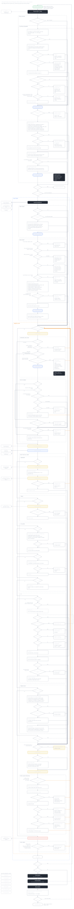

# aphrollo-tools roadmap

**Approved 2026-10-03.** This file is the source of the roadmap; the design it executes is `docs/trellis-architecture.md`, which holds the detail for every item below. The tool is named trellis from the move to its own repo onward; until then the code is aphrollo-tools.

## Goal

The owner, 2026-10-02:

> trellis helps the agent write better code faster, like a trellis for a plant: it supports and guides, it does not cage. You let the agent work on your repo (fanvue, etc.) and what it merges does not break, without the gate slowing it down or blocking it wrongly.

Three measures say whether it does. Each is recorded per consuming repo, and the targets stand until a month of data confirms them.

| Measure | What is counted | Where the data comes from | Target |
| --- | --- | --- | --- |
| Speed | Task start to merged PR, p50 | `events.jsonl`: lane opened, merge recorded | falling month on month, per repo |
| First-try quality | PRs green in CI on the first run; escaped defects per 100 merged PRs in consuming repos (a revert, a fix commit on the same lines within 7 days, a regression issue) | GitHub's CI history, git history of the consuming repo, its issues | first-run green at or above 85%; escaped defects falling every week |
| Friction | Gate wall time per task; agent tokens spent on gate round trips per task; wrong blocks | gate stage timings in `events.jsonl`; a local per-task token count from the session; wrong blocks detected automatically, not only through `gate feedback` | commit gate p95 under 60 s and merge gate under 5 min on Windows; wrong blocks near 0 |

A wrong block is detected when a deny is followed by an override or by `tdd` set off, when a test is deleted before the merge, or when a test is vacuous (it passes with the code under test removed). `gate feedback` stays as one more source.

The rule: every phase and every feature is judged by whether it moves these numbers. Anything that does not is cut.

## Principle: guide, not cage

The default is fast feedback and a named next step: what to do, why, and the override. A hard block is only for real damage (a write to the primary checkout or to main, a test touching the real repo or the global git config, a secret) or where measured data shows the block saves more time than it costs. Every deny carries a rule id, its cause and the override command. A stage that blocks and does not pay for itself is demoted to a warning (measurement, F4).

The git-shim walls stay until per-repo git hooks replace them: refusing `--no-verify` and `-c core.hooksPath` on the primary checkout, and a move off main. They are real-damage walls that nothing else holds.

## Where it stands

The fixes keep landing fast, but each round adds load and the gate got worse. The 2026-10-02 audit:

| Measure | Value | Source |
| --- | --- | --- |
| PRs green in CI on the first run | 91% on 09-25 to 09-27, 56% on 09-29 to 09-30, 54% on 10-02 | GitHub CI history, all boxes |
| Edit-hook runs that never tested the code | 40%, 10-02 | gate log, Windows box, one day |
| Merge-gate runs that blocked / timed out | 66% / 6%, 10-02 | gate log, Windows box, one day |
| Gate time per change before CI | about 28 min, 10-02 | gate log, Windows box, one day |
| Commits fixing something merged 7 days earlier or less | 15% overall; 39% on 09-26 to 09-30 | git history, this repo |
| Lines added in 14 days | +158,000, 57% of the Go code | git history, this repo |
| Issues opened against closed, 14 days | 199 against 190; 27% caused by this repo's own changes | GitHub issues |
| Escapes in 7 days, by cause | 12 local-against-CI mutation disagreements, 11 the gate's own canary, 3 real CI test reds | gate log, both boxes |

Only the CI, git and issue rows cover several days and both boxes. The hook-level rows (edit runs, merge gate, gate time) are one Windows day; earlier days ran on the Linux box. The Linux baseline is still to be run, and budgets are fixed only after it.

What the numbers say: 23 of the 26 escapes are the gate disagreeing with itself, and only 3 are product defects a test should have caught, so a target on all escapes rewards the wrong work. The gate is slow and often untested. Growth outran structure: a fix lands in one call site and misses its sibling. State and processes are scattered across packages, which is where the Windows fork bomb (#997), the 26 GB mutant (#1005) and the writes into the real repository (#1043) came from.

## Decisions of 2026-10-03

The owner approved the architecture and decided:

- **Approach:** a hybrid strangler. Refactor inside aphrollo-tools; write the spine and kernel fresh beside the old code; move unchanged the parts that encode past incidents.
- **F timebox:** about 6 weeks. If the exit gate is unmet at the end, ship what landed and re-plan.
- **Lane caps:** at most 600 production lines in one domain (tests not counted, pure moves exempt), 4 lanes open, 2 of them on the spine.
- **Red to green:** the default is warn, until the A/B (at least 30 lanes per arm) shows enforce winning on escaped defects at no more than +10% friction.
- **Repo move:** to harryberg1n/trellis at the start of 1b, because the release workflow, plugin manifest and pin URLs all name the repo.
- **Release cadence:** a tag per merged PR that bumps the version. Replay gates the tags from F5.

Kept from before: the name trellis; Go; a Claude Code plugin pinning one binary version, built on hosted runners; no telemetry leaves the box; escapes split into product escapes and gate disagreements; lanes are Claude Code's native worktrees keyed by branch. The compatibility policy (versions, consumer changelog, migration, release replay, safety invariants, rollback) is in the architecture, with items 1 and 2 done in #1106.

## Roadmap

Lanes run in order inside a phase; nothing new enters a running phase. Phase 0 (#1102 and #1103, the fanvue unblock) finishes beside F0 on disjoint files. Effort: 67 lanes, about 12 weeks at the caps; F is 42 lanes, about 6 weeks. Consumers keep running aphrollo at a release tag until B9; each cutover is per repo, pinned, replayed first and reversible with `trellis eject`.

| Step | What | Measured |
| --- | --- | --- |
| F0a | Release channel: `update` and the Linux deploy follow the newest release tag, not `main`; doctor checks for two live gates | consumer-visible changes per tag, not per merge |
| F0b | Hot path: slot wait out of the foreground budget, fewer detached jobs per edit, cheaper fingerprint and ratchet walk | infra-failed 46 per 3 days to 0 |
| F1 | Mutation at the level its data earns: commit report-only, CI report outside the required checks, rules out of the brief | first-run green 46% to about 83% |
| F0c | Sharded `test-windows` CI job; the merge gate accepts green per-OS verdicts when the trees match | merge gate p50 261 s to about 1 s on a match |
| F3 | Spikes, committed as fixtures: launcher latency, `CLAUDE_ENV_FILE`, context delivery, follow rate after a deny, the Linux recordings | each item recorded |
| F4 | Events v1 at the final path; `trellis stats`; the brief-length check | one baseline week on both boxes |
| F5-F6 | Release replay per tag; fast test tiers | 0 new hits; own CI `test` p50 4.0 min |
| run | `internal/run`: every exec, memory cap, tree kill; call sites move package by package | exec sites outside `run` 170 to 0; not tested under 10% |
| kernel | The lane machine, the TDD machine and the rule table; `engine`; `trellis why` | table and property tests first |
| git | One git client, one status call per batch | git spawns per edit 10+ to at most 1 |
| host | F21b: the host port in `integrate` with a GitHub adapter; the GitHub calls now spread over `internal/workspace`, `internal/tdd/merge`, `internal/ciwhy`, `internal/cireuse` and `issue` move behind it | GitHub call sites outside the port to 0 |
| render | The line grammar, caps as golden tests, the `seen` rule | tokens-per-task baseline |
| store | Checkpoints, lock and fold versions, retention; gate.log retires | lost updates 0 |
| shadow | Red to green and run decisions recorded beside the live hooks for a week | agreement; would-be wrong blocks |
| config | One schema, three layers; 44 to 3 environment variables | misread keys 0 |
| laws | `laws.Plan`; smells as matcher kinds | commit refusals the edit check missed 0 |
| A | Red to green at PreToolUse in warn, plus the A/B; rule table live; escape split; holds as guidance; delta closure, pending merges, `ci wait`; the local adapter of the host port; the GitHub merge-queue path and `--wait` through it | escapes and friction per arm; merge p95 at most 5 min |
| B | Plugin and launcher, release workflow, `trellis init` (offers the merge-queue setup as an owner decision; doctor checks a queue on without `merge_group` in the workflow, and required checks not covering every per-OS job), repo start, deny then EnterWorktree, `why`, `eject`; cut over this repo, go-telegram, fanvue, then borld through the borld session | off-here p95 at most 50 ms; a new box in one step |
| C | `trellis ci` per tree and OS under the merge verb; local merges; divergent trunk | a merge completes with GitHub off |
| M1 | The last aphrollo release switches boxes over; an `aphrollo` alias for one release | none |

**Owner pause before B9.** Phase A ends and B9 waits: no repo is cut over until the owner has seen the A/B results (at least 30 lanes per arm, per arm and per language), the shadow agreement (`aphrollo stats --shadow`, with the budget drops) and the replay result for that repo, and has said go. The go is per repo, never for the next one. B1-B8 may be built before it; none of them cuts a repo over.

**F exits:** the three measures recorded for a week on both boxes; first-run CI green at 85% or more with mutation counted separately; not tested under 10%; 0 exec sites outside `run`; `forwarder_count` falling; every adapter (hook payloads, recorded `gh` responses for the host port) tested on recorded payloads.

## How work is done

- A fix names the sibling paths it checked.
- A green PR merges within 2 hours; a green open PR takes no further pushes.
- The line stops when the fix-on-fix rate passes the trailing 2-week median plus 5 points (baseline taken the week after F1); work restarts after 3 days below it.
- A dead builder's lane is resumed before new work starts.
- No builder claim counts without an artifact: a CI run id, an event line or a committed fixture.

Risks and the full cut list are in the architecture (sections 10 and 12). Stays in aphrollo-tools: `refactor` and the LSP client, `sqlc`, `dev`.

## Open

- [x] **This repo's CI mutation level.** Decided 2026-10-03: mutation is opt-in, report by default, block only when pinned. This repo is opted in at the report level; `mutants-verdict` is no longer a required check, and the merge gate waits for it only where block is pinned.
- [x] **GitHub merge queue adopted 2026-10-03 for this repo.** A ruleset on main (squash, up to 5 per group, all-green grouping); the pipeline runs on `merge_group` (#1193); required checks cover test, lint, build, docs-check, workflow-pins, pr-ratchet, version-check and the five test-windows shards; push-to-main reuses the `merge_group` verdict by sha and tree (#1195); `workspace merge` enqueues bound to the head and `--wait` follows the PR through the queue (lane merge-enqueue, in flight). Reason: strict tree-equal CI reuse made every merge stale the next PR, costing a rebase and a 10–15 min CI round per PR. trellis builds no queue engine of its own.
- [x] **Host port with GitHub and local adapters (2026-10-03).** One port in `integrate` for PR view, head, checks, open, `Land(pr, head)`, queue state and removal reason, run lookup, issue and release. The GitHub adapter picks the merge queue where the base has one, else the API merge with `sha=head`; the local adapter (`ci = local`, GitHub off) is closure plus `git merge --no-ff`. Adapters are tested on recorded responses. One lane (F21b) added: 67 lanes, F 42.
- [ ] **How a host is marked production.** Blocks #1102's fix. Proposed: a user-layer key `host.production = true`.
- [ ] **#999 (first-run setup).** Blocks 1b. Proposed: rescope it to defaults plus `trellis config set`.
- [ ] **Doc-only writes under `isolation = true`.** Blocks B6.

## The whole flow

The session flow, with each trellis step drawn at the Claude Code hook that runs it, is generated from `docs/trellis-flow/session_flow.py`, its source. Where it differs from the architecture, the architecture wins; it is redrawn in 1b.

